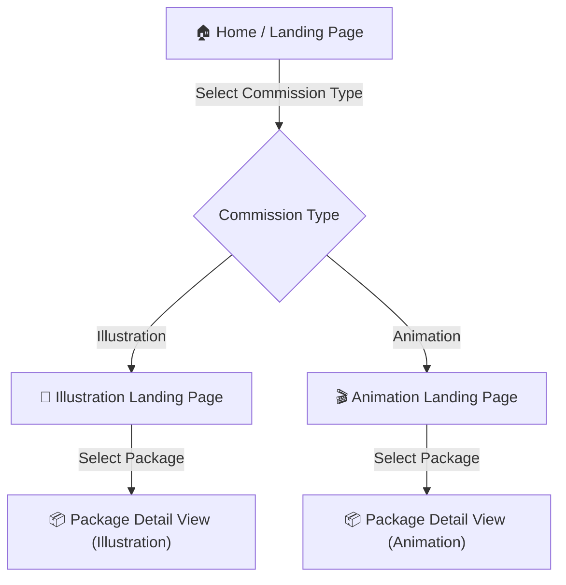
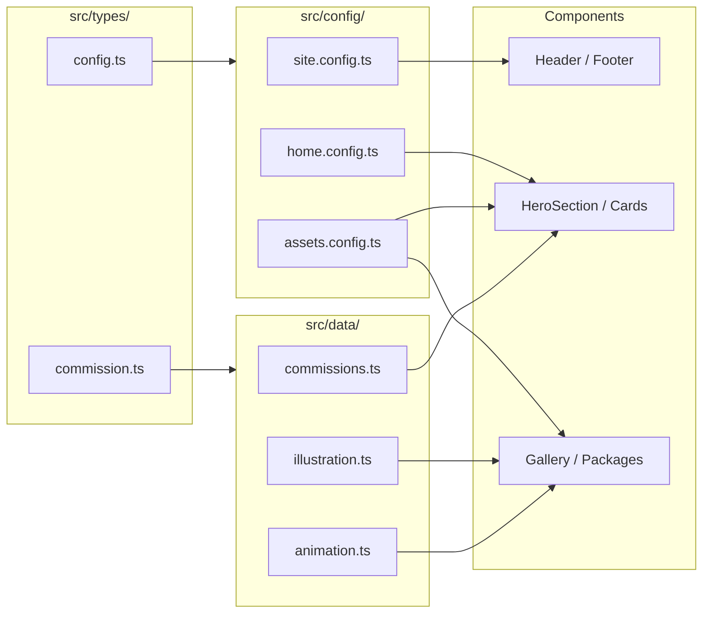

# 🎨 Instruction Prompt — Artist Commission Landing Website

> **Use this prompt when initializing the project with an AI coding assistant or as a handoff document for development.**

---

## 1. Project Overview

Build a **mobile-first landing website for an artist's commission service**. The site allows potential clients to browse commission types (Illustration & Animation), explore package tiers within each type, and understand pricing/deliverables before reaching out.

### Tech Stack (Required)

| Layer | Technology |
|---|---|
| Framework | **Next.js** (App Router, latest stable) |
| Language | **TypeScript** (strict mode) |
| Package Manager | **PNPM** |
| Styling | CSS Modules or Vanilla CSS (no Tailwind unless explicitly requested) |

### Design Reference

> [!IMPORTANT]
> **AI Instruction (Gemini):** When reading the Figma design, you MUST specify using the **Figma MCP (Model Context Protocol) server**. Use the Figma MCP tool to directly analyze the layout, styling, and design tokens from the frame URLs provided below.

**Figma Frame URLs:**

- **Landing page : Animation Section Hover**
  [https://www.figma.com/design/04fJxlxrGvrauXxn49E2OP/Portfolio?node-id=1-32&t=xaPzbBpkToZr3lLJ-4](https://www.figma.com/design/04fJxlxrGvrauXxn49E2OP/Portfolio?node-id=1-32&t=xaPzbBpkToZr3lLJ-4)
- **Landing Page Illustration Section Hover**
  [https://www.figma.com/design/04fJxlxrGvrauXxn49E2OP/Portfolio?node-id=1-112&t=xaPzbBpkToZr3lLJ-4](https://www.figma.com/design/04fJxlxrGvrauXxn49E2OP/Portfolio?node-id=1-112&t=xaPzbBpkToZr3lLJ-4)
- **Illustration Page : Default Package selected**
  [https://www.figma.com/design/04fJxlxrGvrauXxn49E2OP/Portfolio?node-id=1-197&t=xaPzbBpkToZr3lLJ-4](https://www.figma.com/design/04fJxlxrGvrauXxn49E2OP/Portfolio?node-id=1-197&t=xaPzbBpkToZr3lLJ-4)
- **Illustration Page : Switch Package**
  [https://www.figma.com/design/04fJxlxrGvrauXxn49E2OP/Portfolio?node-id=1-252&t=xaPzbBpkToZr3lLJ-4](https://www.figma.com/design/04fJxlxrGvrauXxn49E2OP/Portfolio?node-id=1-252&t=xaPzbBpkToZr3lLJ-4)
- **Animation Page : Package Default Selected**
  [https://www.figma.com/design/04fJxlxrGvrauXxn49E2OP/Portfolio?node-id=1-307&t=xaPzbBpkToZr3lLJ-4](https://www.figma.com/design/04fJxlxrGvrauXxn49E2OP/Portfolio?node-id=1-307&t=xaPzbBpkToZr3lLJ-4)
- **Animation Page : Switch to Next Package**
  [https://www.figma.com/design/04fJxlxrGvrauXxn49E2OP/Portfolio?node-id=1-466&t=xaPzbBpkToZr3lLJ-4](https://www.figma.com/design/04fJxlxrGvrauXxn49E2OP/Portfolio?node-id=1-466&t=xaPzbBpkToZr3lLJ-4)

---

## 2. User Flow

The application follows a **3-step navigation flow**:



### Step-by-Step Breakdown

1. **Home Page — Commission Type Selection**
   - Hero section introducing the artist and their work.
   - Two selectable commission categories presented as visually rich cards:
     - **Illustration**
     - **Animation**
   - Clicking a category navigates the user to a dedicated landing page.

2. **Commission Type Landing Page** (`/illustration` and `/animation`)
   - Dedicated page for each commission type.
   - Showcase section with portfolio samples relevant to the type.
   - Overview of available packages (e.g., Basic, Standard, Premium).
   - Clicking or selecting a package reveals/switches to that package's detail.

3. **Package Detail View** (inline switch, no new page)
   - When a user selects a package tier on the commission landing page, the information area **dynamically switches** to show:
     - Package name & description
     - Deliverables list
     - Pricing
     - Turnaround time
     - Revision policy
     - CTA (Contact / Request Commission)
   - This should be a **smooth, animated transition** — not a full page reload.

---

## 3. Project Initialization

Use the following command to scaffold the project:

```bash
pnpm dlx create-next-app@latest ./ --typescript --eslint --app --src-dir --import-alias "@/*" --use-pnpm
```

> [!IMPORTANT]
> - Initialize in the **current directory** (`./`).
> - Use the `--app` flag for App Router.
> - Use `--src-dir` to keep source code organized under `/src`.
> - Run `--help` first to verify available flags for your version.

### Recommended Project Structure

```
portfolio/
├── src/
│   ├── app/
│   │   ├── layout.tsx              # Root layout (reads from site.config.ts)
│   │   ├── page.tsx                # Home — reads from home.config.ts
│   │   ├── illustration/
│   │   │   └── page.tsx            # Reads from illustration data config
│   │   └── animation/
│   │       └── page.tsx            # Reads from animation data config
│   ├── components/
│   │   ├── ui/                     # Reusable primitives (Button, Card, Badge, etc.)
│   │   ├── layout/                 # Header, Footer, Navigation, MobileNav
│   │   ├── home/                   # Hero, CommissionTypeCard
│   │   ├── commission/             # PackageSelector, PackageDetail, PortfolioGallery
│   │   └── shared/                 # AnimatedSection, SectionHeading, etc.
│   ├── config/                     # ⭐ CENTRALIZED CONFIGURATION
│   │   ├── site.config.ts          # Site-wide settings (name, logo, socials, nav, footer)
│   │   ├── home.config.ts          # Home page content (hero copy, CTA, commission cards)
│   │   └── assets.config.ts        # All asset paths mapped by key
│   ├── data/                       # ⭐ COMMISSION DATA (content owner edits here)
│   │   ├── commissions.ts          # Central registry of all commission types
│   │   ├── illustration.ts         # Full config for Illustration commission
│   │   └── animation.ts            # Full config for Animation commission
│   ├── styles/
│   │   ├── globals.css             # CSS reset, custom properties, design tokens
│   │   ├── variables.css           # Color palette, spacing, typography tokens
│   │   └── animations.css          # Keyframe animations & transitions
│   ├── types/
│   │   ├── commission.ts           # TypeScript interfaces (Package, CommissionType, etc.)
│   │   └── config.ts               # TypeScript interfaces for all config shapes
│   ├── hooks/
│   │   └── useActivePackage.ts     # Hook for package selection state
│   └── lib/
│       ├── utils.ts                # Utility functions
│       └── getCommission.ts        # Helper to look up commission data by slug
├── public/
│   ├── images/
│   │   ├── hero/                   # Hero section images
│   │   ├── portfolio/              # Portfolio sample images
│   │   ├── packages/               # Package-specific images / icons
│   │   ├── og/                     # Open Graph images per page
│   │   └── icons/                  # Custom icons if needed
│   └── fonts/                      # Self-hosted fonts (if any)
├── figma/
│   └── design.fig                  # Figma design file
├── project-description.md
├── next.config.ts
├── tsconfig.json
├── package.json
└── pnpm-lock.yaml
```

---

## 4. Design System & Styling Guidelines

### Mobile-First Approach

> [!IMPORTANT]
> **All styles must be written mobile-first.** Base styles target phones (`< 640px`), then use `min-width` media queries to progressively enhance for larger screens.

```css
/* ✅ Correct: Mobile-first */
.card {
  padding: 1rem;
  flex-direction: column;
}

@media (min-width: 768px) {
  .card {
    padding: 2rem;
    flex-direction: row;
  }
}
```

### Breakpoints

| Name | Min-Width | Target |
|---|---|---|
| `sm` | `640px` | Large phones / small tablets |
| `md` | `768px` | Tablets |
| `lg` | `1024px` | Laptops |
| `xl` | `1280px` | Desktops |

### Design Tokens (CSS Custom Properties)

Define all tokens in `src/styles/variables.css`:

```css
:root {
  /* Colors — derive from Figma design */
  --color-primary: /* from Figma */;
  --color-secondary: /* from Figma */;
  --color-accent: /* from Figma */;
  --color-bg: /* from Figma */;
  --color-surface: /* from Figma */;
  --color-text-primary: /* from Figma */;
  --color-text-secondary: /* from Figma */;

  /* Typography */
  --font-heading: /* from Figma or Google Fonts */;
  --font-body: /* from Figma or Google Fonts */;

  /* Spacing scale */
  --space-xs: 0.25rem;
  --space-sm: 0.5rem;
  --space-md: 1rem;
  --space-lg: 1.5rem;
  --space-xl: 2rem;
  --space-2xl: 3rem;
  --space-3xl: 4rem;

  /* Border radius */
  --radius-sm: 0.375rem;
  --radius-md: 0.75rem;
  --radius-lg: 1rem;
  --radius-full: 9999px;

  /* Shadows */
  --shadow-sm: 0 1px 2px rgba(0, 0, 0, 0.05);
  --shadow-md: 0 4px 6px rgba(0, 0, 0, 0.1);
  --shadow-lg: 0 10px 25px rgba(0, 0, 0, 0.15);

  /* Transitions */
  --transition-fast: 150ms ease;
  --transition-base: 300ms ease;
  --transition-slow: 500ms ease;
}
```

### Visual Standards

- **Premium feel**: Use glassmorphism, subtle gradients, and depth via shadows.
- **Micro-animations**: Hover effects on cards, smooth package transitions, parallax or fade-in on scroll.
- **Typography**: Use modern Google Fonts (e.g., `Inter`, `Outfit`, `Plus Jakarta Sans`). Never rely on system defaults.
- **Color palette**: Curated and harmonious — avoid raw primary colors. Derive from Figma.
- **Imagery**: Use actual portfolio samples. If placeholders are needed, generate them via AI image tools — **never use gray boxes**.

---

## 5. Component Specifications

> [!IMPORTANT]
> **Every component must read its content from config/data files.** No text, image paths, prices, or labels should be hardcoded inside JSX. Components receive data via props or import from `src/config/` and `src/data/`.

### 5.1 Home Page Components

#### `HeroSection`
- Full-viewport or near-full hero with artist introduction.
- **All copy** (heading, subheading, CTA text, CTA link) comes from `home.config.ts`.
- **Background image/gradient** path comes from `home.config.ts → hero.backgroundImage`.
- Animated entrance (fade-in, slide-up).

#### `CommissionTypeCard`
- Dynamically renders cards by mapping over `home.config.ts → commissionCards[]`.
- Each card config provides: `image`, `title`, `tagline`, `href`.
- Hover effect (scale, glow, or parallax).
- **Never hardcode the number of cards** — the component maps over the array.

### 5.2 Commission Landing Page Components

#### `PortfolioGallery`
- Receives `portfolioSamples[]` from the commission data config.
- Grid or carousel of sample works for the commission type.
- Lightbox/modal on click for larger view (optional for v1).
- Lazy-loaded images with blur placeholders.

#### `PackageSelector`
- Renders tabs/buttons by mapping over `packages[]` from the commission data config.
- Active state visually distinct (underline, background fill, or border).
- Switching packages triggers a smooth content transition.
- **Supports any number of packages** — not hardcoded to 3.

#### `PackageDetail`
- Receives the active `Package` object as a prop.
- Animated container that renders all fields from the config:
  - `name`, `description`, `deliverables[]`, `price`, `turnaroundDays`, `revisions`
  - Optional: `sampleImage`, `extras[]`
  - **CTA Button**: Text and link come from `Package.ctaText` / `Package.ctaLink` in config.
- Transition: Fade + slide or crossfade between packages.

### 5.3 Shared / Layout Components

#### `Header` / `MobileNav`
- **Logo, site name, and navigation links** all come from `site.config.ts`.
- Sticky header with hamburger menu on mobile (slide-in drawer).
- Smooth scroll or route-based navigation.

#### `Footer`
- **Social links, copyright text, contact email** all come from `site.config.ts → footer`.
- Minimal and clean.

---

## 6. Configuration & Data Architecture

> [!CAUTION]
> **ZERO HARDCODED CONTENT.** Every piece of text, every image path, every price, every link that appears on the site MUST originate from a config or data file. Components are purely structural and stylistic — they render whatever the config tells them to.

### 6.1 Architecture Diagram



### 6.2 TypeScript Interfaces

```typescript
// src/types/config.ts

export interface SiteConfig {
  name: string;                    // Artist / brand name
  logo: string;                    // Path to logo image
  tagline: string;
  navigation: NavItem[];
  footer: FooterConfig;
  socials: SocialLink[];
  contact: ContactConfig;
}

export interface NavItem {
  label: string;
  href: string;
}

export interface FooterConfig {
  copyright: string;               // e.g., "© 2026 ArtistName"
  showSocials: boolean;
  additionalLinks: NavItem[];
}

export interface SocialLink {
  platform: string;                // "twitter" | "instagram" | "pixiv" | etc.
  url: string;
  icon: string;                    // Path to icon or icon component name
}

export interface ContactConfig {
  email: string;
  formUrl?: string;                // External form link if used
}

export interface HomeConfig {
  hero: HeroConfig;
  commissionCards: CommissionCardConfig[];
}

export interface HeroConfig {
  heading: string;
  subheading: string;
  backgroundImage: string;
  ctaText: string;
  ctaLink: string;
}

export interface CommissionCardConfig {
  commissionSlug: string;          // Links to CommissionType.slug
  image: string;
  title: string;
  tagline: string;
  href: string;
}

export interface AssetsConfig {
  hero: Record<string, string>;          // key → image path
  portfolio: Record<string, string[]>;   // commissionSlug → image paths
  packages: Record<string, string>;      // packageId → image path
  og: Record<string, string>;            // page slug → OG image path
  icons: Record<string, string>;         // icon name → path
}
```

```typescript
// src/types/commission.ts

export interface Package {
  id: string;
  name: string;               // e.g., "Basic", "Standard", "Premium"
  description: string;
  price: string;               // e.g., "$50", "Starting at $120"
  currency: string;            // e.g., "USD", "THB"
  deliverables: string[];
  turnaroundDays: number;
  revisions: number;
  featured?: boolean;          // Highlight as recommended
  sampleImage?: string;        // Path to a sample for this tier
  extras?: string[];           // Additional perks (e.g., "Commercial license")
  ctaText: string;             // e.g., "Request Commission"
  ctaLink: string;             // e.g., mailto: or form URL
}

export interface CommissionType {
  id: string;
  slug: string;                // "illustration" | "animation"
  name: string;
  tagline: string;
  description: string;
  heroImage: string;
  ogImage: string;             // Open Graph image for this page
  packages: Package[];
  portfolioSamples: PortfolioItem[];
  seo: PageSEO;                // SEO metadata for this page
}

export interface PortfolioItem {
  id: string;
  src: string;
  alt: string;
  width: number;
  height: number;
  category?: string;           // Optional tag for filtering
}

export interface PageSEO {
  title: string;
  description: string;
  ogImage: string;
}
```

### 6.3 Config Files

#### `src/config/site.config.ts` — Site-wide settings

```typescript
import { SiteConfig } from '@/types/config';

export const siteConfig: SiteConfig = {
  name: 'Artist Name',
  logo: '/images/icons/logo.svg',
  tagline: 'Digital Art & Animation',
  navigation: [
    { label: 'Home', href: '/' },
    { label: 'Illustration', href: '/illustration' },
    { label: 'Animation', href: '/animation' },
  ],
  footer: {
    copyright: '© 2026 Artist Name. All rights reserved.',
    showSocials: true,
    additionalLinks: [
      { label: 'Terms of Service', href: '/tos' },
    ],
  },
  socials: [
    { platform: 'twitter', url: 'https://twitter.com/artist', icon: '/images/icons/twitter.svg' },
    { platform: 'instagram', url: 'https://instagram.com/artist', icon: '/images/icons/instagram.svg' },
  ],
  contact: {
    email: 'commissions@artist.com',
  },
};
```

#### `src/config/home.config.ts` — Home page content

```typescript
import { HomeConfig } from '@/types/config';

export const homeConfig: HomeConfig = {
  hero: {
    heading: 'Commissions Open',
    subheading: 'Bringing your ideas to life through illustration and animation.',
    backgroundImage: '/images/hero/home-hero.jpg',
    ctaText: 'View Commission Types',
    ctaLink: '#commissions',
  },
  commissionCards: [
    {
      commissionSlug: 'illustration',
      image: '/images/hero/illustration-card.jpg',
      title: 'Illustration',
      tagline: 'Custom artwork tailored to your vision',
      href: '/illustration',
    },
    {
      commissionSlug: 'animation',
      image: '/images/hero/animation-card.jpg',
      title: 'Animation',
      tagline: 'Motion that tells your story',
      href: '/animation',
    },
  ],
};
```

#### `src/config/assets.config.ts` — Centralized asset registry

```typescript
import { AssetsConfig } from '@/types/config';

export const assetsConfig: AssetsConfig = {
  hero: {
    home: '/images/hero/home-hero.jpg',
    illustration: '/images/hero/illustration-hero.jpg',
    animation: '/images/hero/animation-hero.jpg',
  },
  portfolio: {
    illustration: [
      '/images/portfolio/illust-01.jpg',
      '/images/portfolio/illust-02.jpg',
      // ... add more
    ],
    animation: [
      '/images/portfolio/anim-01.jpg',
      '/images/portfolio/anim-02.jpg',
      // ... add more
    ],
  },
  packages: {
    'illust-basic': '/images/packages/illust-basic-sample.jpg',
    'illust-standard': '/images/packages/illust-standard-sample.jpg',
    'illust-premium': '/images/packages/illust-premium-sample.jpg',
    // ... animation packages
  },
  og: {
    home: '/images/og/home.jpg',
    illustration: '/images/og/illustration.jpg',
    animation: '/images/og/animation.jpg',
  },
  icons: {
    logo: '/images/icons/logo.svg',
    twitter: '/images/icons/twitter.svg',
    instagram: '/images/icons/instagram.svg',
  },
};
```

### 6.4 Commission Data Files

#### `src/data/illustration.ts` — Full illustration commission config

```typescript
import { CommissionType } from '@/types/commission';

export const illustrationCommission: CommissionType = {
  id: 'illustration',
  slug: 'illustration',
  name: 'Illustration',
  tagline: 'Bring your vision to life',
  description: 'High-quality custom illustrations for personal and commercial use.',
  heroImage: '/images/hero/illustration-hero.jpg',
  ogImage: '/images/og/illustration.jpg',
  seo: {
    title: 'Illustration Commissions — Artist Name',
    description: 'Commission custom illustrations. Choose from multiple packages.',
    ogImage: '/images/og/illustration.jpg',
  },
  packages: [
    {
      id: 'illust-basic',
      name: 'Basic',
      description: 'Simple character illustration with flat colors.',
      price: '$XX',
      currency: 'USD',
      deliverables: [
        'Single character',
        'Simple background',
        'High-res PNG file',
      ],
      turnaroundDays: 7,
      revisions: 2,
      sampleImage: '/images/packages/illust-basic-sample.jpg',
      ctaText: 'Request Basic',
      ctaLink: 'mailto:commissions@artist.com?subject=Basic%20Illustration',
    },
    {
      id: 'illust-standard',
      name: 'Standard',
      description: 'Detailed character illustration with rendered shading.',
      price: '$XX',
      currency: 'USD',
      deliverables: [
        'Single character',
        'Detailed background',
        'High-res PNG + PSD files',
      ],
      turnaroundDays: 14,
      revisions: 3,
      featured: true,
      sampleImage: '/images/packages/illust-standard-sample.jpg',
      ctaText: 'Request Standard',
      ctaLink: 'mailto:commissions@artist.com?subject=Standard%20Illustration',
    },
    {
      id: 'illust-premium',
      name: 'Premium',
      description: 'Full illustration with complex composition and effects.',
      price: '$XX',
      currency: 'USD',
      deliverables: [
        'Multiple characters',
        'Full scenic background',
        'High-res PNG + PSD + process video',
        'Commercial license included',
      ],
      turnaroundDays: 21,
      revisions: 5,
      extras: ['Commercial license', 'Process video'],
      sampleImage: '/images/packages/illust-premium-sample.jpg',
      ctaText: 'Request Premium',
      ctaLink: 'mailto:commissions@artist.com?subject=Premium%20Illustration',
    },
  ],
  portfolioSamples: [
    {
      id: 'illust-sample-01',
      src: '/images/portfolio/illust-01.jpg',
      alt: 'Illustration sample 1',
      width: 1200,
      height: 800,
    },
    // ... more samples
  ],
};
```

#### `src/data/animation.ts` — Same structure for animation

```typescript
import { CommissionType } from '@/types/commission';

export const animationCommission: CommissionType = {
  // Same shape as illustrationCommission
  // with animation-specific content, packages, and samples
};
```

#### `src/data/commissions.ts` — Central registry

```typescript
import { CommissionType } from '@/types/commission';
import { illustrationCommission } from './illustration';
import { animationCommission } from './animation';

export const allCommissions: CommissionType[] = [
  illustrationCommission,
  animationCommission,
];

// Helper: look up by slug (used by dynamic pages)
export function getCommissionBySlug(slug: string): CommissionType | undefined {
  return allCommissions.find((c) => c.slug === slug);
}
```

### 6.5 How Components Consume Config

> [!IMPORTANT]
> Follow this pattern consistently across the entire project.

```typescript
// ✅ CORRECT — Component reads from config
import { homeConfig } from '@/config/home.config';

export function HeroSection() {
  const { heading, subheading, backgroundImage, ctaText, ctaLink } = homeConfig.hero;

  return (
    <section style={{ backgroundImage: `url(${backgroundImage})` }}>
      <h1>{heading}</h1>
      <p>{subheading}</p>
      <a href={ctaLink}>{ctaText}</a>
    </section>
  );
}

// ❌ WRONG — Hardcoded content
export function HeroSection() {
  return (
    <section style={{ backgroundImage: `url('/images/hero.jpg')` }}>
      <h1>Commissions Open</h1>
      <p>Bringing your ideas to life</p>
      <a href="#commissions">View Commission Types</a>
    </section>
  );
}
```

### 6.6 Adding a New Commission Type

The config-driven architecture makes it trivial to add new commission types:

1. Create `src/data/newtype.ts` following the `CommissionType` shape.
2. Add it to `src/data/commissions.ts` → `allCommissions[]`.
3. Add a card entry in `src/config/home.config.ts` → `commissionCards[]`.
4. Add asset paths in `src/config/assets.config.ts`.
5. Create `src/app/newtype/page.tsx` (or use a dynamic route `[slug]`).

**No component code needs to change.**
```

---

## 7. SEO & Metadata

Each page must generate metadata **from the config/data files** — never hardcode titles or descriptions:

```typescript
// Example: src/app/illustration/page.tsx
import { Metadata } from 'next';
import { illustrationCommission } from '@/data/illustration';

// ✅ SEO metadata is derived from the commission data config
export const metadata: Metadata = {
  title: illustrationCommission.seo.title,
  description: illustrationCommission.seo.description,
  openGraph: {
    title: illustrationCommission.seo.title,
    description: illustrationCommission.seo.description,
    images: [illustrationCommission.seo.ogImage],
  },
};
```

### SEO Checklist

- [ ] Unique `<title>` per page
- [ ] Meta descriptions on all pages
- [ ] Single `<h1>` per page
- [ ] Semantic HTML (`<main>`, `<section>`, `<article>`, `<nav>`, `<footer>`)
- [ ] Alt text on all images
- [ ] Open Graph tags for social sharing
- [ ] Structured data (JSON-LD) for the service (optional for v1)

---

## 8. Accessibility Requirements

- All interactive elements must be keyboard-accessible.
- Sufficient color contrast ratios (WCAG AA minimum).
- Focus indicators on interactive elements.
- Proper ARIA labels on icon-only buttons and navigation.
- Reduced-motion support:

```css
@media (prefers-reduced-motion: reduce) {
  *, *::before, *::after {
    animation-duration: 0.01ms !important;
    transition-duration: 0.01ms !important;
  }
}
```

---

## 9. Performance Guidelines

- **Images**: Use Next.js `<Image>` component for automatic optimization. Provide `width` and `height` to prevent layout shift.
- **Fonts**: Use `next/font` for zero-CLS font loading.
- **Code Splitting**: Leverage Next.js automatic code splitting. Use `dynamic()` for heavy components.
- **Lazy Loading**: Load below-the-fold images and heavy components lazily.
- **Target Metrics**:
  - LCP < 2.5s
  - FID < 100ms
  - CLS < 0.1

---

## 10. Implementation Phases

### Phase 1 — Foundation & Config Layer
- [ ] Initialize Next.js project with PNPM
- [ ] Set up project structure (directories, aliases)
- [ ] **Create all TypeScript interfaces** (`src/types/config.ts`, `src/types/commission.ts`)
- [ ] **Create `site.config.ts`** with name, logo, nav, footer, socials
- [ ] **Create `home.config.ts`** with hero content and commission cards
- [ ] **Create `assets.config.ts`** with all asset path mappings
- [ ] **Create commission data files** (`illustration.ts`, `animation.ts`, `commissions.ts`)
- [ ] Configure design tokens and global styles
- [ ] Set up typography (Google Fonts via `next/font`)

### Phase 2 — Core Pages & Navigation
- [ ] Build root layout with Header and Footer
- [ ] Build Home page with HeroSection and CommissionTypeCards
- [ ] Set up routing for `/illustration` and `/animation`
- [ ] Implement mobile navigation (hamburger + drawer)

### Phase 3 — Commission Pages
- [ ] Build commission landing page template
- [ ] Implement PortfolioGallery component
- [ ] Implement PackageSelector with tab/button UI
- [ ] Implement PackageDetail with animated content switching
- [ ] Wire up data from `src/data/`

### Phase 4 — Polish & Optimization
- [ ] Add micro-animations (scroll reveals, hover effects, transitions)
- [ ] Implement responsive refinements across all breakpoints
- [ ] Add SEO metadata to all pages
- [ ] Performance audit (Lighthouse)
- [ ] Accessibility audit
- [ ] Cross-browser testing

---

## 11. Development Commands

```bash
# Install dependencies
pnpm install

# Start development server
pnpm dev

# Build for production
pnpm build

# Start production server
pnpm start

# Lint
pnpm lint
```

---

## 12. Key Reminders

> [!CAUTION]
> - **Do NOT hardcode ANY content in components.** All text, images, prices, links, and labels must come from config/data files.
> - **Do NOT use placeholder gray boxes for images.** Generate or source real visuals.
> - **Do NOT use Tailwind CSS** unless explicitly requested.
> - **Do NOT skip mobile styles.** Mobile-first is a hard requirement.

> [!TIP]
> - **The config files are the single source of truth.** To change content, the artist only needs to edit files in `src/config/` and `src/data/` — never touch component code.
> - Reference the Figma design at every step for colors, spacing, and layout.
> - Keep the package switching interaction **buttery smooth** — this is a key UX moment.
> - The site should feel like a portfolio itself — the design _is_ the portfolio.
> - When adding a new commission type, **no component code should change** — only config/data files.

---

*Generated from [project-description.md](file:///Users/tharitpongsaneh/Muam-Work/portfolio/project-description.md) on 2026-04-13.*
